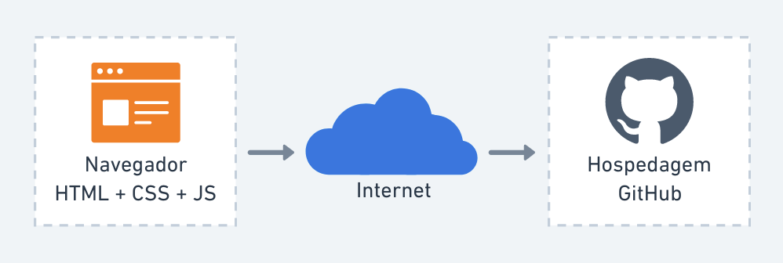

# Arquitetura da Solução

Nesta seção são apresentados os detalhes técnicos da solução criada pela equipe, tratando dos componentes que fazem parte da solução e do ambiente de hospedagem da mesma.

## Diagrama de componentes

Os componentes que fazem parte da solução são apresentados na Figura abaixo.

Figura 01 - Arquitetura da Solução

A solução implementada conta com os seguintes módulos:
- **Navegador** — interface básica com sistema (Client)  
- **Páginas Web** — conjunto de arquivos HTML, CSS, JavaScript e imagens que implementam as funcionalidades do sistema.
- **Github Pages** — serviço de nuvem que permite o acesso às páginas _‘web’_ através do navegador.
Ele será utilizado na hospedagem por ser um serviço do Github que permite hospedagem de arquivos de HTML, CSS e Javascript sem cobrança pela disponibilização de tais serviços, além da facilidade na disponibilização de **entrega contínua** sem necessidade de configuração adicional.

A imagem a seguir ilustra a o fluxo do usuário em nossa solução. Assim
que o usuário entra na plataforma, ele é apresentado à tela inicial
(Tela 1) onde ele é confrontado com as opões de editar seu perfil ou
então visualizar sua galeria.

Caso ele opte por seguir pelo primeiro caminho (Editar Perfil), ele é
redirecionado para a tela de edição de perfil (Tela 2), onde pode
atualizar seus dados cadastrais. Nessa tela, o usuário também pode
escolher para editar sua foto de perfil. Ao selecionar essa opção, ele é
redirecionado para a Tela 3, onde ele a imagem expandida do perfil do
usuário é mostrado. Ao selecionar a opção para atualizar a imagem, uma
nova janela abre pedindo para o usuário fazer o upload da nova foto.
Assim que o processo termina um pop-up exibe o status para o usuário
(Tela 4) e o usuário é redirecionado para a Tela 2.

Caso o usuário opte seguir pelo segundo caminho (Visualizar Galeria) ele
é redirecionado para a Tela 5 com todas as fotos que o usuário possui. O
usuário pode clicar em um post qualquer para visualizar os detalhes do
post (Tela 6). Nessa tela, ele pode então escolher editar o post, sendo
redirecionado para a Tela 7. Ao editar as informações, o usuário pode
escolher salvar ou deletar o post. Em ambos os casos o status é
notificado para o usuário (Tela 8) e em seguida ele é redirecionado
para a Tela 2.

## Tecnologias Utilizadas

Serão utilizadas as seguintes tecnologias no desenvolvimento:

### IDE:
 - Visual Studio Code

### Linguagens utilizadas:
 - HTML
 - CSS
 - JavaScript

### Ferramentas de Modelagem:
 - MarvelApp
 - Whimsical

## Hospedagem

O site será hospedado no GitHub Pages no link [exemplo.github.io](https://example.github.io)[^1], e será atualizado através de pushes com o git no repositório do Grupo 4 - [Acessibilidade na Real](https://github.com/ICEI-PUC-Minas-PMV-ADS/pmv-ads-2022-2-e1-proj-web-t1-acessibilidade-na-real).

[^1]: O link ainda está para ser definido.
